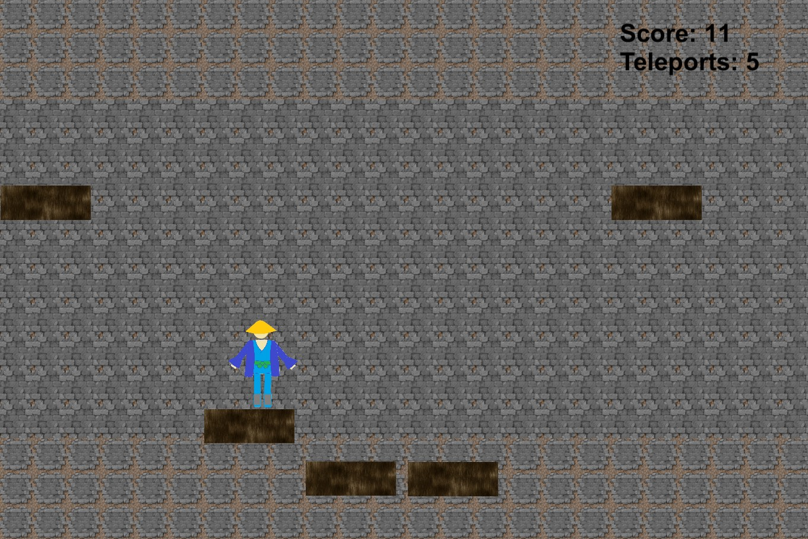
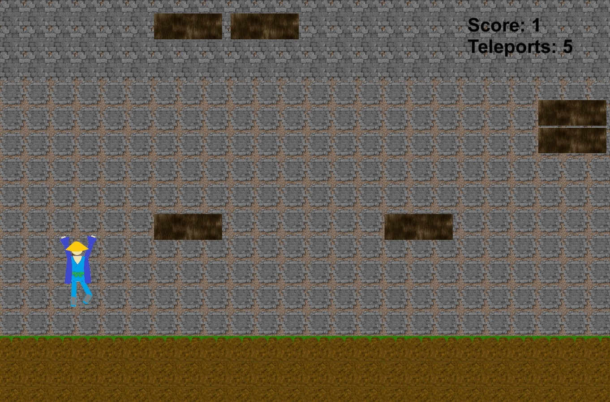

# Branch2BranchGame

TECHNICAL SKILLS APPLIED:
- Learned how to use the Unity Engine
- Practiced designed, implementation and debugging
- Used object-oriented programming and C#

- Implemented skeleton animation
- Adjusted game design, physics, visuals and object movements for a better user-experience
- //

GAME DESCRIPTION: 
- User controls character that attempts to reach the top
- Character must jump on falling logs to propel upward
- Character can teleport a fixed distance

CONTROLS:
- Character can only teleport if velocity is upward
- Fixed # of teleports deplete and will be replenish with time
- 'Space' to teleport
- 'Arrow Pad' to move

Author: Jadd
Nov 24, 2020
